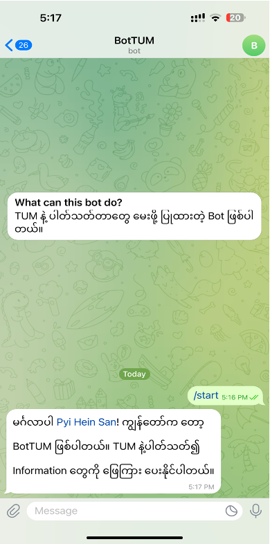
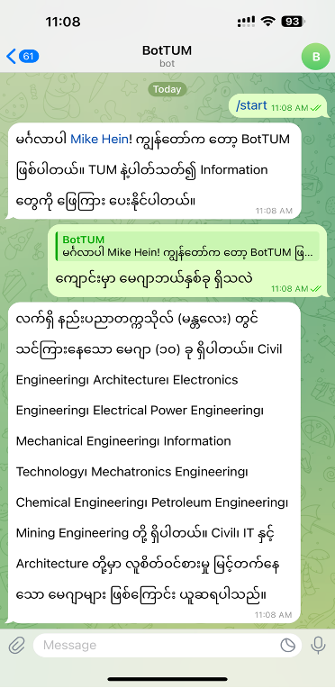
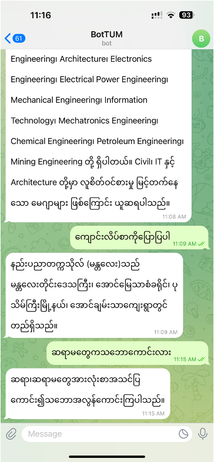

# Campus-Chatbot-in-Telegram

This is a university ChatBot Using NLTK and set up in telegram API.
To test the model and collect data.
Using Intents classification method and Support for myanmar language.
## Installation requirements

```bash
  pip install -r requirements.txt
```
    
## How to run the app
Model file ကို အရင်ဆုံး တစ်ခါ ပြန် train လုပ်ပြီးမှ run ရင်တော့ ပိုကောင်းပါတယ်။ 

You need to fill the telegram API token key before you run the chatbot_telegram3.py.

```bash
  python3 chatbot_telegram3.py
```
    
## Screenshot






## License

[MIT](https://choosealicense.com/licenses/mit/)


## Badges


[](https://choosealicense.com/licenses/mit/)

